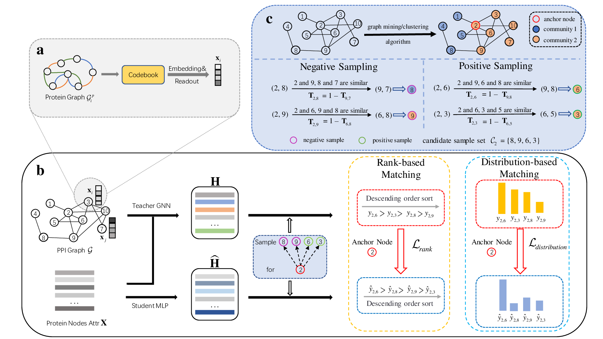

<div style="text-align: center;">
  <h1>KDCS-PPI: Knowledge Distillation with Counterfactual Sampling for Protein-Protein Interaction prediction</h1>
</div>

## Introduction

<div align="center">
  
  <p><b></b>framework</p>
</div>

This study proposes a method for Protein-Protein Interaction prediction. As the core of various biochemical reactions in life, Protein-Protein Interactions (PPIs) play a crucial role in maintaining the homeostasis of cellular functions, making the accurate prediction of PPIs particularly important.

Traditional wet lab methods for predicting PPIs are time-consuming and costly. In contrast, PPI prediction methods utilizing Graph Neural Networks (GNNs) have exhibited promising performance and have increasingly emerged as the predominant approach in recent years. While GNNs rely on neighbor message aggregation, which can result in computational inefficiencies, MultiLayer Perceptrons (MLPs) stand out for their time efficiency, as they do not require intricate handling of relational knowledge. However, MLPs often exhibit comparatively lower prediction accuracy.

To leverage the advantages of both GNNs and MLPs in terms of effectiveness and efficiency, knowledge distillation techniques can be used to transfer the knowledge learned by GNNs to MLPs. During the knowledge distillation process, the knowledge transfer usually involves node feature embeddings rather than the interaction relationship knowledge between PPIs. Moreover, current methods frequently choose positive and negative samples for anchor nodes via random sampling, leading to suboptimal accuracy, especially for negative samples. To address this, we propose ***K**nowledge **D**istillation with **C**ounterfactual **S**ampling for **P**rotein-**P**rotein **I**nteraction prediction*} (KDCS-PPI). Our method facilitates the transfer of diverse relational knowledge between proteins during the knowledge distillation process and utilizes a counterfactual sampling strategy to select more pertinent positive and negative examples. Extensive experiments on three datasets demonstrate that KDCS-PPI can be applied to large-scale PPI prediction tasks and achieves significant improvements in both effectiveness and computational efficiency compared to other benchmark methods.

## Dependencies

```
conda env create -f environment.yml
conda activate KDCS-PPI
```

## Dataset
The datasets used in this study—**STRING**, **SHS148k**, and **SHS27k**—can be downloaded from [Google Drive](https://drive.google.com/file/d/1xZjnXQh1Z0u1DVO4uwcMjhuiUBNbvi-h/view?usp=drive_link). 

After downloading, please extract the data into the `KDCS-PPI/dataset/string/` directory.

## Usage

### 1. Pretrain the teacher network
```
python src/train_teacher_gnn.py --dataset SHS27k
```
### 2. Train the student model
```
python src/main.py --dataset SHS27k
```
Available datasets include **SHS27k**, **SHS148**, and **STRING**.

## Acknowlegdements
Part of code borrow from [MAPE-PPI](https://github.com/LirongWu/MAPE-PPI) and [LLP](https://github.com/snap-research/linkless-link-prediction/). Thanks for their excellent work!

## Feedback
If you have any issue about this work, please feel free to contact me by email: 

* Bin Deng: 2023212061@nwnu.edu.cn